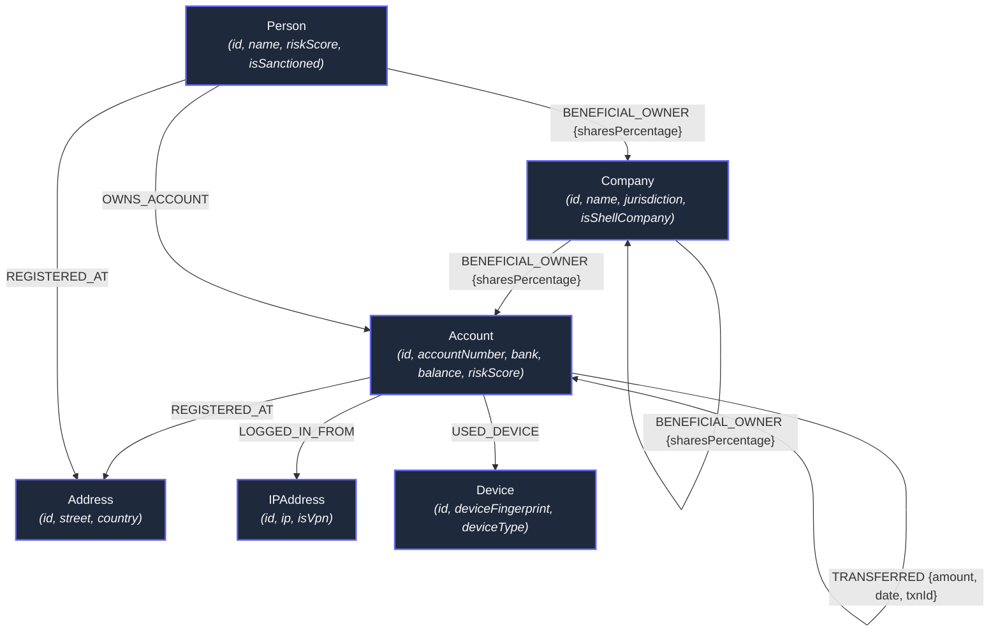

# NexusAML — Financial Crime & Graph Intelligence Application

> **Wexa AI Take-Home Assignment Deliverable**  
> Backed by **CognoDB Cloud** (openCypher over Bolt protocol via official `neo4j-driver`).

NexusAML is an enterprise graph database application designed for compliance teams and financial crime analysts to detect complex multi-hop money laundering schemes, shell company Ultimate Beneficial Owner (UBO) chains, synthetic identity fraud rings, and sanctioned entity risk paths in real-time.

---

## 1. Why a Graph Database?

Financial crime topologies are fundamentally graph problems where critical insights lie in **relationships and multi-hop paths** rather than isolated rows in relational tables:

1. **Multi-Hop Layering Detection**: Money laundering involves moving funds across multiple intermediate accounts (`A -> B -> C -> D -> A`) to obscure audit trails. In relational SQL, detecting variable-length cycles (2 to 5 hops) requires memory-heavy recursive Common Table Expressions (CTEs) or nested self-joins with high query complexity. In CognoDB openCypher, pattern matching with `(a:Account)-[:TRANSFERRED*2..5]->(a)` is written natively and evaluates blazingly fast.
2. **Index-Free Adjacency**: Traditional databases use global indexes to join tables (`O(N log N)` time complexity per join). Graph databases like CognoDB use pointer-based index-free adjacency (`O(1)` per hop), making search performance scale with local subgraph size rather than total database rows.
3. **Deep Ownership Resolution (UBO)**: Unmasking ultimate human controllers behind multi-tier offshore shell companies involves traversing nested corporate ownership hierarchies. Graph databases natively traverse arbitrary-depth paths (`[:BENEFICIAL_OWNER*1..6]`).
4. **Heterogeneous Shared Infrastructure**: Synthetic identity rings share IP addresses, hardware device fingerprints, and physical street addresses. Graph modeling treats attributes as nodes connected by typed edges, eliminating the need for multi-table join tables.

---

## 2. Graph Data Model

The application models financial entities as labeled nodes and directed typed relationships:



### Node Labels & Properties
- **`Account`**: `{id, accountNumber, bank, balance, currency, riskScore, flag}`
- **`Person`**: `{id, name, nationality, riskScore, isSanctioned, ssnMasked}`
- **`Company`**: `{id, name, registrationNo, jurisdiction, isShellCompany, riskScore}`
- **`Address`**: `{id, street, city, country, postalCode}`
- **`IPAddress`**: `{id, ip, country, isVpn, isTorExit}`
- **`Device`**: `{id, deviceFingerprint, deviceType, os}`

### Typed Relationships
- `(:Account)-[:TRANSFERRED {amount, date, currency, txnId}]->(:Account)`
- `(:Person|Company)-[:BENEFICIAL_OWNER {sharesPercentage, title}]->(:Company|Account)`
- `(:Account)-[:LOGGED_IN_FROM]->(:IPAddress)`
- `(:Account)-[:USED_DEVICE]->(:Device)`
- `(:Account)-[:REGISTERED_AT]->(:Address)`

---

## 3. Key Cypher Queries Explained

All queries use **parameterised Cypher execution** via the official `neo4j-driver` (no string-concatenated Cypher).

### Query A: Multi-Hop Circular Money Laundering (Layering)
```cypher
MATCH path = (origin:Account)-[r:TRANSFERRED*2..5]->(origin)
WITH origin, path, r, reduce(total = 0.0, tx IN r | total + toFloat(tx.amount)) AS totalVolume
RETURN origin, path, totalVolume, length(path) AS hopCount
ORDER BY totalVolume DESC
LIMIT $limit
```
* **Why Graph DB?** Finds money flows that originate at an account, pass through 2 to 5 intermediate hops, and return to the origin. In SQL, this requires expensive recursive CTE joins.

### Query B: Ultimate Beneficial Owner (UBO) Shell Hierarchy Tracing
```cypher
MATCH path = (owner:Person)-[:BENEFICIAL_OWNER*1..6]->(target:Company)
WHERE target.isShellCompany = true OR owner.riskScore > 75
RETURN owner, target, path, length(path) AS tierCount
ORDER BY tierCount DESC
LIMIT $limit
```
* **Why Graph DB?** Traces multi-tier corporate ownership chains through offshore holding companies to unmask the ultimate individual owner.

### Query C: Synthetic Identity Ring & Shared Infrastructure
```cypher
MATCH (a1:Account)-[:LOGGED_IN_FROM|USED_DEVICE|REGISTERED_AT]->(infra)<-[:LOGGED_IN_FROM|USED_DEVICE|REGISTERED_AT]-(a2:Account)
WHERE a1.id < a2.id
RETURN a1, infra, a2, labels(infra)[0] AS infraType
LIMIT $limit
```
* **Why Graph DB?** Identifies clusters of separate accounts that secretly share physical addresses, IP addresses, or device fingerprints.

---

## 4. Setup & Running Instructions

### Prerequisites
- Node.js (v18+) and `npm`

### Step 1: Clone & Install Dependencies
```bash
git clone <repository-url>
cd wexa-ai
npm install
```

### Step 2: Set Up CognoDB Cloud Instance
1. Go to [console.cognodb.com/signup](https://console.cognodb.com/signup) and create a free account.
2. From the console, create a free **(c0)** instance.
3. Copy your connection URI (`bolt+s://<instance-id>.databases.cognodb.cloud`) and generated password.
4. Create a `.env` file in the project root:

```env
COGNO_URI=bolt+s://your-instance-id.databases.cognodb.cloud
COGNO_USER=cognodb
COGNO_PASSWORD=your_saved_password
PORT=3001
```

> *Note: If no database credentials are standard, the application will automatically enter **Demo Fallback Mode** with a pre-loaded graph dataset so the application UI can be evaluated immediately!*

### Step 3: Seed Database
Populate CognoDB with realistic financial network data:
```bash
npm run seed
```

### Step 4: Run Application
Start the API server and Vite frontend dev server concurrently:
```bash
npm run dev
```
Open [http://localhost:3000](http://localhost:3000) in your browser.

---

## 5. Engineering Architecture

```
wexa-ai/
├── package.json          # Project configuration & scripts
├── .env.example          # Environment variable template
├── README.md             # Architecture, graph model & setup guide
├── scripts/
│   └── seed.js           # CognoDB database seed script (neo4j-driver)
├── server/
│   ├── index.js          # Express API server & routes
│   ├── db.js             # Neo4j driver connection pool & cypher executor
│   └── queries.js        # Parameterised openCypher query registry
└── src/
    ├── index.html        # HTML entrypoint with typography
    ├── main.jsx          # React DOM root render
    ├── App.jsx           # Main application view container
    ├── index.css         # Dark glassmorphism design system
    └── components/
        ├── Navbar.jsx            # Header & connection status indicator
        ├── GraphCanvas.jsx       # Cytoscape.js interactive network viewer
        ├── FraudWorkbench.jsx    # Cypher query execution suite
        ├── SqlVsGraphExplainer.jsx # "Why Graph Database?" benchmark view
        └── DbConfigModal.jsx     # CognoDB Cloud setup guidance modal
```

---

## 6. Security & Best Practices
- **Credential Protection**: Connection details (`COGNO_URI`, `COGNO_PASSWORD`) are loaded strictly from process environment variables (`dotenv`) and excluded via `.gitignore`.
- **Injection Prevention**: All Cypher queries use parameterised variables (`$accountId`, `$limit`) passed via `neo4j-driver` session execution.
- **Graceful Error Handling**: Database unreachable / unconfigured states are handled gracefully with clean UI indicators and offline fallback mode.
