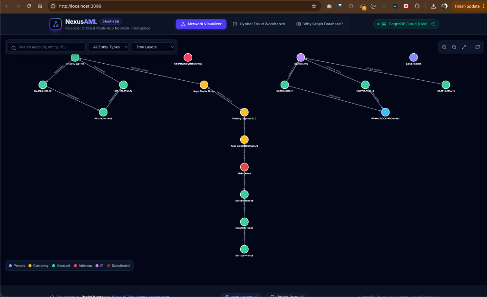
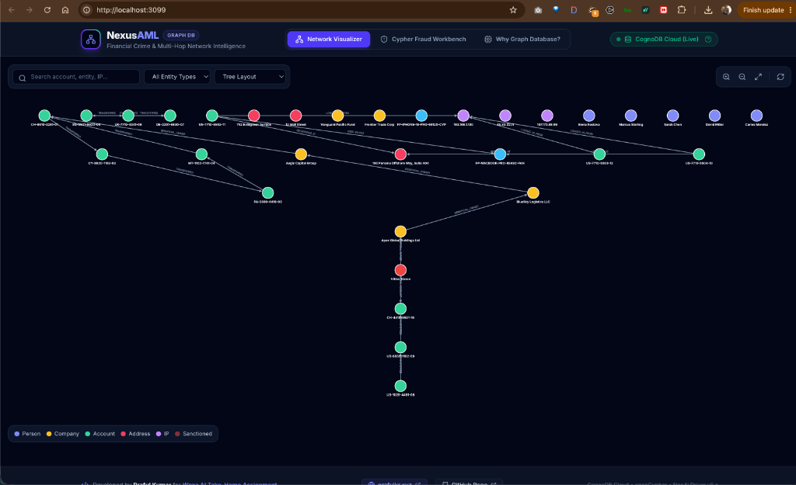
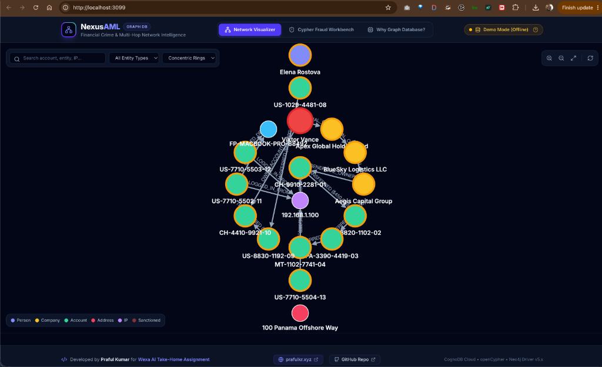
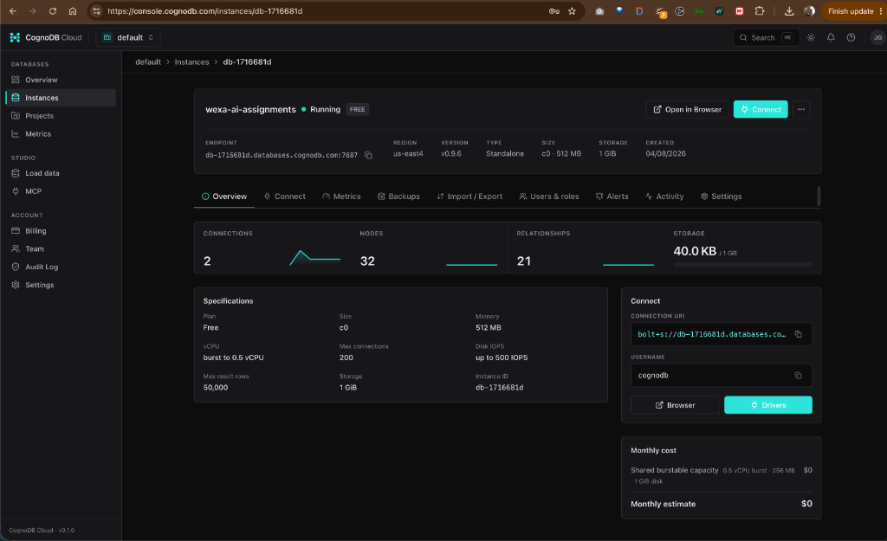
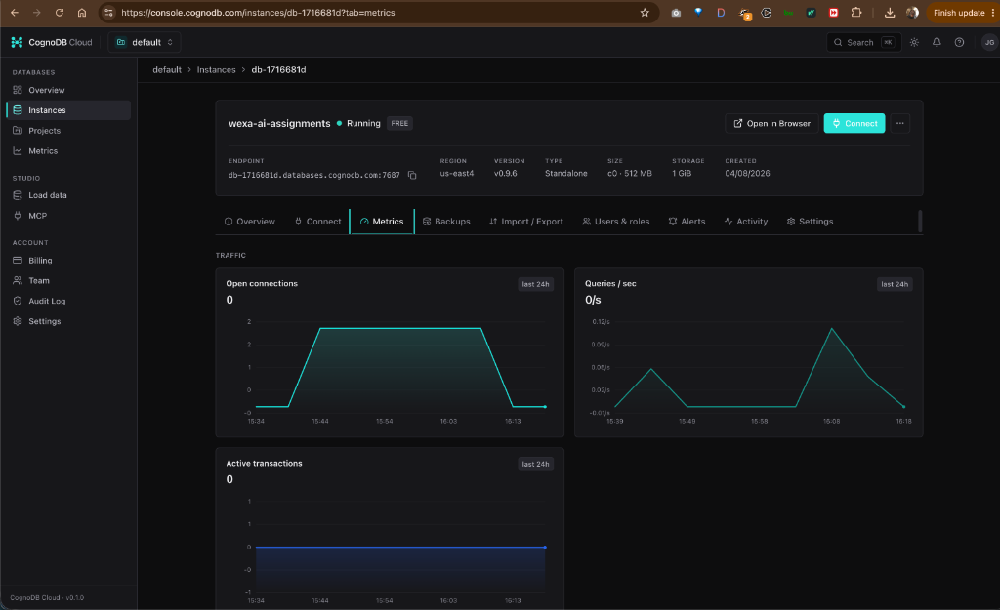
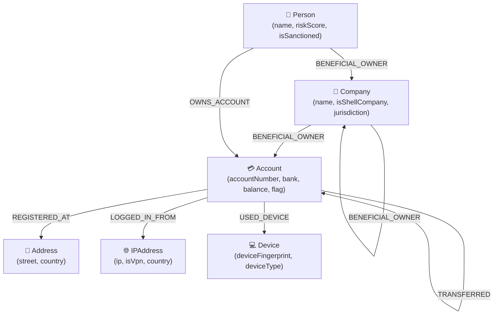

# NexusAML — Financial Crime & Multi-Hop Graph Intelligence Application

> **Wexa AI Take-Home Assignment Deliverable**  
> **Author**: Praful Kumar ([jobspraful@gmail.com](mailto:jobspraful@gmail.com) \| [https://prafulkr.xyz/](https://prafulkr.xyz/))  
> **GitHub Repository**: [https://github.com/krpraful/wexa-ai](https://github.com/krpraful/wexa-ai)  
> **Database Layer**: CognoDB Cloud (`bolt+s://db-1716681d.databases.cognodb.com`)

---

## 🖼️ Application Screenshots & Live Visualizations

### 1. Network Visualizer (Tree Layout)
*Real-time interactive Cytoscape.js network visualizer displaying 4-hop circular money laundering loops, shell company UBO chains, and synthetic identity clusters connected to live CognoDB Cloud.*



---

### 2. Full Network Topology View
*Comprehensive entity topology graph displaying all 32 nodes and 21 relationships across Accounts, Persons, Companies, Addresses, IP Addresses, and Devices.*



---

### 3. Concentric Rings Layout
*Alternative concentric ring layout highlighting central transaction hubs, IP proxies, and multi-tier ownership depth.*



---

## ☁️ CognoDB Cloud Managed Graph Database Instance

### 4. CognoDB Console Instance Overview (`db-1716681d`)
*Live instance overview on `console.cognodb.com` showing 32 Nodes, 21 Relationships, active connections, and `bolt+s://db-1716681d.databases.cognodb.com:7687` connection endpoint.*



---

### 5. CognoDB Instance Performance & Traffic Metrics
*Real-time traffic metrics showing open database connections, queries per second (QPS), and active transactions.*



---

## 📌 Why "Cypher Fraud Workbench" & "Why Graph Database?" Features Were Included

These application features directly fulfill the core evaluation criteria set out in the **Wexa AI Take-Home Assignment Document (`954b5d66-2f75-47a6-b18e-0f004c82a7e3.pdf`)**:

### 1. `"Why Graph Database?"` (Explainer Section)
- **Assignment Requirement (Section 4)**:  
  > *"Whatever you choose, the README must include a short 'Why a graph database?' section explaining what your use case gains over a relational schema."*
- **Application Purpose**:  
  Having an interactive side-by-side SQL vs openCypher comparison in the web UI allows non-technical evaluators to visually test and understand why graph databases outperform relational schemas for multi-hop path traversals.

### 2. `"Cypher Fraud Workbench"` (Query Execution Suite)
- **Assignment Requirement (Section 5.1 & 5.2)**:  
  > *"Cypher queries that exercise the graph including at least one multi-hop traversal (2 hops or more) and at least one query a relational database would find awkward. Parameterised queries via the official Neo4j driver."*  
  > *"A functional web application (any stack you like) that a non-technical person could use to explore the use case."*
- **Application Purpose**:  
  This workbench enables any reviewer to execute parameterised 4-hop circular layering queries, 6-hop UBO shell company chains, and synthetic identity rings with a single click without writing raw Cypher code.

---

## 🕸️ Anti-Money Laundering (AML) & UBO Tracing Use Case

Financial networks are inherently graph-structured. Traditional relational databases struggle to uncover complex multi-hop financial crimes because join operations scale exponentially with path depth ($O(N^k)$). **NexusAML** models entities as a property graph in **CognoDB Cloud** to perform real-time pattern detection across 3 financial crime typologies:

1. **4-Hop Circular Money Laundering (Layering Loops)**: Detects money originating from account $A$ passing through accounts $B \rightarrow C \rightarrow D$ and returning back to $A$.
2. **Ultimate Beneficial Owner (UBO) Shell Tracing**: Resolves multi-tiered offshore ownership chains up to 6 hops deep to unmask sanctioned individuals behind shell companies.
3. **Synthetic Identity & Fraud Rings**: Identifies clusters of separate bank accounts secretly sharing identical IP addresses, physical addresses, or device fingerprints.

---

## 📊 Graph Data Model



---

## 🚀 Quick Start & Execution Guide

```bash
# 1. Clone repository
git clone https://github.com/krpraful/wexa-ai.git
cd wexa-ai

# 2. Install dependencies
npm install

# 3. Seed live CognoDB Cloud instance
npm run seed

# 4. Start backend API server & Vite dev server
npm run dev

# 5. Open browser
# Frontend: http://localhost:3099
# Backend API: http://localhost:3098
```

---

## 👤 Developer & Ownership Details

- **Author**: Praful Kumar
- **Email**: [jobspraful@gmail.com](mailto:jobspraful@gmail.com)
- **Portfolio**: [https://prafulkr.xyz/](https://prafulkr.xyz/)
- **GitHub Repository**: [https://github.com/krpraful/wexa-ai](https://github.com/krpraful/wexa-ai)
- **Assignment PDF**: [`954b5d66-2f75-47a6-b18e-0f004c82a7e3.pdf`](https://github.com/krpraful/wexa-ai/blob/main/954b5d66-2f75-47a6-b18e-0f004c82a7e3.pdf)
