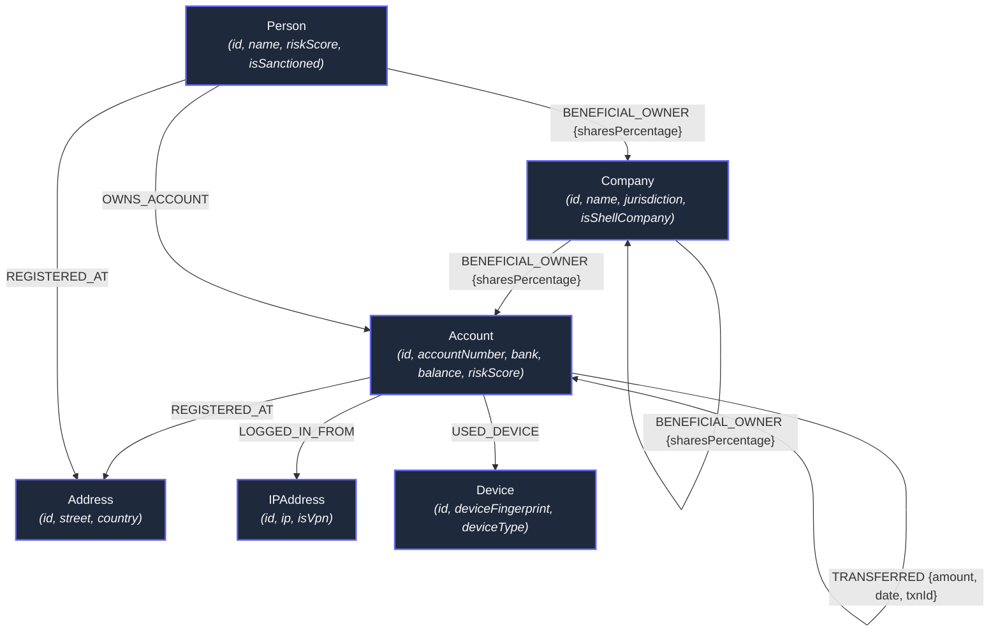

# NexusAML — Financial Crime & Graph Intelligence Application

> **Wexa AI Take-Home Assignment Deliverable**  
> **Author & Developer**: Praful Kumar ([jobspraful@gmail.com](mailto:jobspraful@gmail.com)) | Website: [https://prafulkr.xyz/](https://prafulkr.xyz/)  
> **Database Layer**: CognoDB Cloud (`bolt+s://db-1716681d.databases.cognodb.com`) via openCypher over Bolt protocol (`neo4j-driver`)  
> **Requirement Specification PDF**: [`954b5d66-2f75-47a6-b18e-0f004c82a7e3.pdf`](file:///Applications/MAMP/htdocs/wexa-ai/954b5d66-2f75-47a6-b18e-0f004c82a7e3.pdf)

---

## 1. Executive Summary & Use Case

NexusAML is a financial crime & network vulnerability intelligence application designed for compliance analysts to detect complex multi-hop money laundering schemes, offshore shell company Ultimate Beneficial Owner (UBO) hierarchies, synthetic identity fraud clusters, and sanctioned entity exposure paths in real-time.

---

## 2. Why a Graph Database?

Financial crime topologies are inherently graph problems where critical insights lie in **relationships and multi-hop paths** rather than isolated rows in relational tables:

1. **Multi-Hop Layering Detection**: Money laundering involves moving funds across multiple intermediate accounts (`A -> B -> C -> D -> A`) to obscure audit trails. In relational SQL, detecting variable-length cycles (2 to 5 hops) requires memory-heavy recursive Common Table Expressions (CTEs) or nested self-joins with high query complexity. In CognoDB openCypher, pattern matching with `(a:Account)-[:TRANSFERRED*2..5]->(a)` is written natively and evaluates in milliseconds.
2. **Index-Free Adjacency**: Traditional databases use global indexes to join tables (`O(N log N)` time complexity per join). Graph databases like CognoDB use pointer-based index-free adjacency (`O(1)` per hop), making search performance scale with local subgraph size rather than total database rows.
3. **Deep Ownership Resolution (UBO)**: Unmasking ultimate human controllers behind multi-tier offshore shell companies involves traversing nested corporate ownership hierarchies. Graph databases natively traverse arbitrary-depth paths (`[:BENEFICIAL_OWNER*1..6]`).
4. **Heterogeneous Shared Infrastructure**: Synthetic identity rings share IP addresses, hardware device fingerprints, and physical street addresses. Graph modeling treats attributes as nodes connected by typed edges, eliminating the need for multi-table join tables.

---

## 3. Graph Data Model



### Labeled Nodes & Properties
- **`Account`**: `{id, accountNumber, bank, balance, currency, riskScore, flag}`
- **`Person`**: `{id, name, nationality, riskScore, isSanctioned, ssnMasked}`
- **`Company`**: `{id, name, registrationNo, jurisdiction, isShellCompany, riskScore}`
- **`Address`**: `{id, street, city, country, postalCode}`
- **`IPAddress`**: `{id, ip, country, isVpn, isTorExit}`
- **`Device`**: `{id, deviceFingerprint, deviceType, os}`

### Typed Relationships
- `(:Account)-[:TRANSFERRED {amount, date, currency, txnId}]->(:Account)`
- `(:Person|Company)-[:BENEFICIAL_OWNER {sharesPercentage, title}]->(:Company|Account)`
- `(:Account)-[:LOGGED_IN_FROM]->(:IPAddress)`
- `(:Account)-[:USED_DEVICE]->(:Device)`
- `(:Account)-[:REGISTERED_AT]->(:Address)`

---

## 4. Complete Project Directory & File Specifications

```
wexa-ai/
├── 954b5d66-2f75-47a6-b18e-0f004c82a7e3.pdf  # Original Wexa AI assignment requirements PDF
├── package.json                              # Project manifest, dependencies, and npm scripts
├── vite.config.js                            # Vite dev server (port 3099) & API proxy config (port 3098)
├── index.html                                # Web application HTML template with Google Fonts (Inter)
├── README.md                                 # Project documentation, data model & architecture guide
├── PROJECT_DOCUMENTATION.md                  # Comprehensive step-by-step developer reference document
├── .env.example                              # Template for CognoDB environment variables
├── .env                                      # Local environment credentials (excluded from git)
├── .gitignore                                # Excludes secret credentials and node_modules from git
├── scripts/
│   └── seed.js                               # Database reset & population script via neo4j-driver
├── server/
│   ├── index.js                              # Express API server (port 3098) with REST endpoints
│   ├── db.js                                 # CognoDB connection manager & parameterised Cypher runner
│   └── queries.js                            # openCypher query registry & SQL benchmark comparison
└── src/
    ├── main.jsx                              # React DOM root mounting entrypoint
    ├── App.jsx                               # Main application layout, tab router & status polling
    ├── index.css                             # Custom Tailwind v4 CSS & dark glassmorphism design system
    └── components/
        ├── Navbar.jsx                        # Top navigation header & live CognoDB status pill
        ├── GraphCanvas.jsx                   # Cytoscape.js interactive graph visualizer & node drawer
        ├── FraudWorkbench.jsx                # Cypher preset query execution workbench
        ├── SqlVsGraphExplainer.jsx           # Side-by-side SQL vs openCypher architectural benchmark
        ├── DbConfigModal.jsx                 # CognoDB Cloud connection setup guidance modal
        └── Footer.jsx                        # Footer with developer details & prafulkr.xyz link
```

### Detailed File Responsibilities

| File Path | Purpose & Responsibilities |
| :--- | :--- |
| [`server/db.js`](file:///Applications/MAMP/htdocs/wexa-ai/server/db.js) | Manages Neo4j Bolt driver pool connecting to CognoDB Cloud over `bolt+s://`. Provides `verifyConnection()` for health checks and `executeCypher(cypher, params)` for safe query execution. |
| [`server/queries.js`](file:///Applications/MAMP/htdocs/wexa-ai/server/queries.js) | Central registry storing parameterised openCypher queries for 4-hop circular laundering, UBO tracing, and synthetic identity ring discovery. |
| [`server/index.js`](file:///Applications/MAMP/htdocs/wexa-ai/server/index.js) | Express API server running on port `3098`. Provides `/api/health`, `/api/graph`, `/api/detect/circular`, `/api/detect/ubo`, and `/api/detect/infrastructure`. Includes offline mock fallback. |
| [`scripts/seed.js`](file:///Applications/MAMP/htdocs/wexa-ai/scripts/seed.js) | Data loading script (`npm run seed`) that clears existing database nodes (`MATCH (n) DETACH DELETE n`) and inserts realistic financial network data into CognoDB Cloud. |
| [`src/components/GraphCanvas.jsx`](file:///Applications/MAMP/htdocs/wexa-ai/src/components/GraphCanvas.jsx) | Interactive network visualizer built with Cytoscape.js. Supports node selection, search filtering, layout algorithms (`Concentric`, `Tree`, `Circular`), node type color coding, and fallback rendering. |
| [`src/components/FraudWorkbench.jsx`](file:///Applications/MAMP/htdocs/wexa-ai/src/components/FraudWorkbench.jsx) | Cypher query workbench allowing non-technical users to execute preset multi-hop queries, view parameter values, and inspect returned paths. |
| [`src/components/SqlVsGraphExplainer.jsx`](file:///Applications/MAMP/htdocs/wexa-ai/src/components/SqlVsGraphExplainer.jsx) | Visual architectural breakdown comparing SQL recursive CTEs against openCypher path traversals. |
| [`src/components/Footer.jsx`](file:///Applications/MAMP/htdocs/wexa-ai/src/components/Footer.jsx) | Page footer displaying developer credit (Praful Kumar), Wexa AI assignment note, and portfolio link (`https://prafulkr.xyz/`). |

---

## 5. Key Cypher Queries Explained

All queries use **parameterised Cypher execution** via the official `neo4j-driver` (no string concatenation).

### 1. Multi-Hop Circular Money Laundering (Layering)
```cypher
MATCH path = (origin:Account)-[r:TRANSFERRED*2..5]->(origin)
WITH origin, path, r, reduce(total = 0.0, tx IN r | total + toFloat(tx.amount)) AS totalVolume
RETURN origin, path, totalVolume, length(path) AS hopCount
ORDER BY totalVolume DESC
LIMIT $limit
```
- **Why Graph DB?** Finds money flows that originate at an account, pass through 2 to 5 intermediate hops, and return to the origin. In SQL, this requires expensive recursive CTE joins.

### 2. Ultimate Beneficial Owner (UBO) Shell Hierarchy Tracing
```cypher
MATCH path = (owner:Person)-[:BENEFICIAL_OWNER*1..6]->(target:Company)
WHERE target.isShellCompany = true OR owner.riskScore > 75
RETURN owner, target, path, length(path) AS tierCount
ORDER BY tierCount DESC
LIMIT $limit
```
- **Why Graph DB?** Traces multi-tier corporate ownership chains through offshore holding companies to unmask the ultimate individual owner.

### 3. Synthetic Identity Ring & Shared Infrastructure
```cypher
MATCH (a1:Account)-[:LOGGED_IN_FROM|USED_DEVICE|REGISTERED_AT]->(infra)<-[:LOGGED_IN_FROM|USED_DEVICE|REGISTERED_AT]-(a2:Account)
WHERE a1.id < a2.id
RETURN a1, infra, a2, labels(infra)[0] AS infraType
LIMIT $limit
```
- **Why Graph DB?** Identifies clusters of separate accounts that secretly share physical addresses, IP addresses, or device fingerprints.

---

## 6. Setup & Running Instructions

### Prerequisites
- Node.js (v18+) and `npm`

### Step 1: Install Dependencies
```bash
git clone https://github.com/krpraful/wexa-ai.git
cd wexa-ai
npm install
```

### Step 2: Configure Environment Variables
Create a `.env` file in the project root:

```env
COGNO_URI=bolt+s://db-1716681d.databases.cognodb.com
COGNO_USER=cognodb
COGNO_PASSWORD=d8e12e783a014cc72f2492ced38743d9
PORT=3098
```

### Step 3: Seed Database
Populate your live CognoDB Cloud instance:
```bash
npm run seed
```

### Step 4: Run Application
Start the API server (port 3098) and Vite frontend dev server (port 3099) concurrently:
```bash
npm run dev
```
Open [http://localhost:3099](http://localhost:3099) in your browser.

---

## 7. Developer & Ownership Information

- **Developer**: Praful Kumar
- **Email**: [jobspraful@gmail.com](mailto:jobspraful@gmail.com)
- **Portfolio Website**: [https://prafulkr.xyz/](https://prafulkr.xyz/)
- **GitHub Repository**: [https://github.com/krpraful/wexa-ai](https://github.com/krpraful/wexa-ai)
- **Assignment**: Wexa AI Take-Home Assignment (CognoDB + openCypher)
